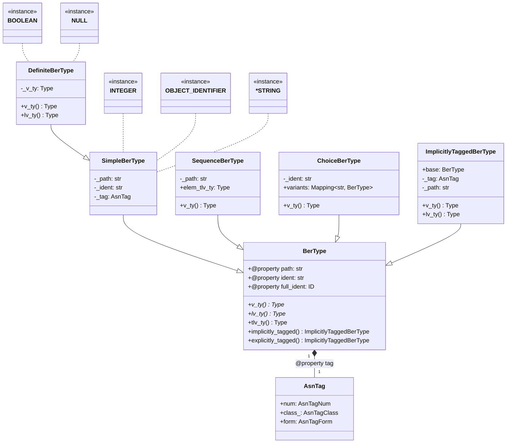
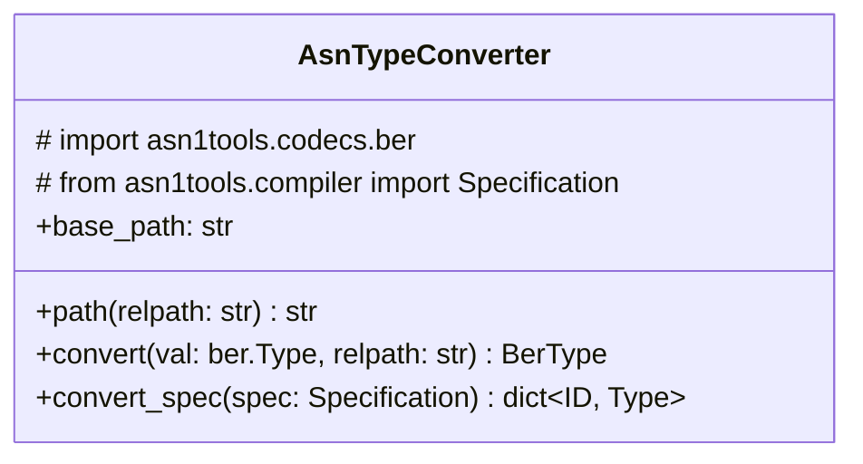

# Architecture

## Contents

- [Architecture](#architecture)
  - [Contents](#contents)
  - [`prelude.py`](#preludepy)
  - [`convert.py`](#convertpy)

## `prelude.py`

Includes the basic elements to describe the ASN.1 prelude types (i.e. those with a `UNIVERSAL` tag) as well as types with other tags (with `ImplicitlyTaggedBerType`).

Several prelude types of the `PRIMITIVE` form are also defined in this module:

- `BOOLEAN`
- `NULL`
- `INTEGER`
- `OBJECT_IDENTIFIER`
- `*STRING`
  - `BIT_STRING`
  - `OCTET_STRING`
  - `PrintableString`
  - `IA5String`

## `convert.py`

The `AsnTypeConverter` class converts an instance of `asn1tools.compiler.Specification` to a collection of RecordFlux types `dict[rflx.identifier.ID, rflx.model.model.Type]`, so that they can be used to form a `rflx.model.Model`, and then exported to actual `.rflx` files.

